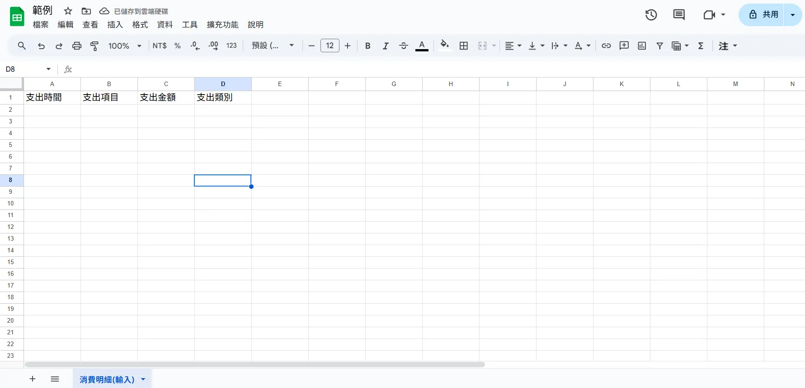
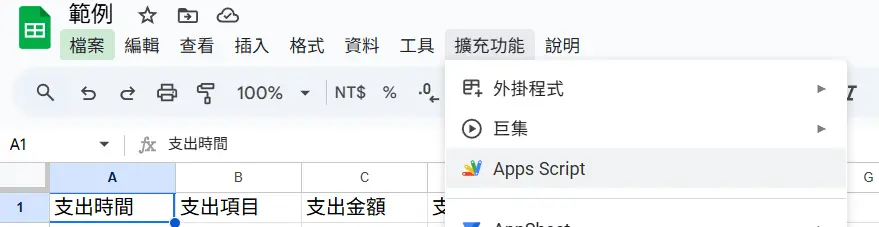
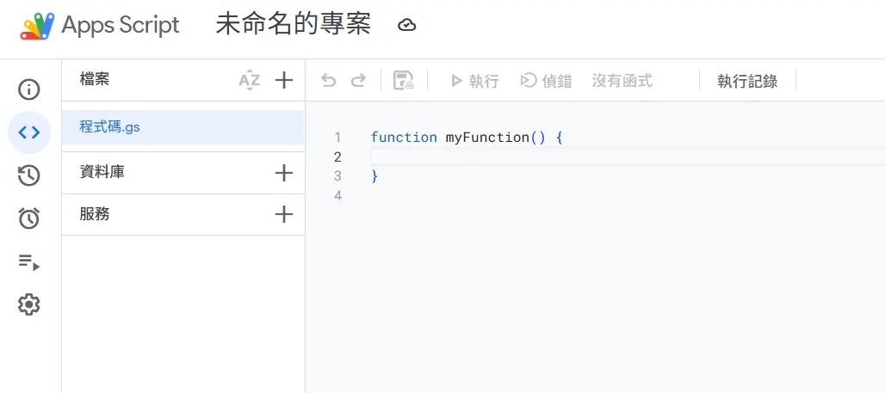
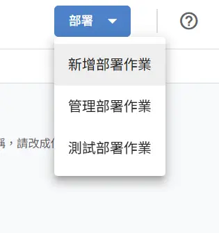
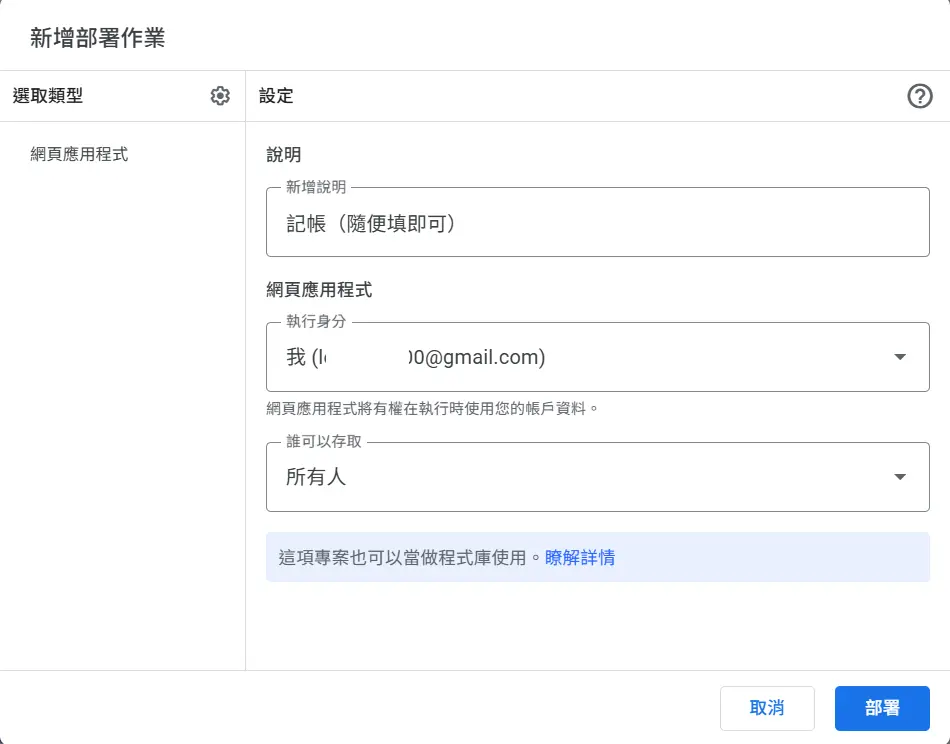
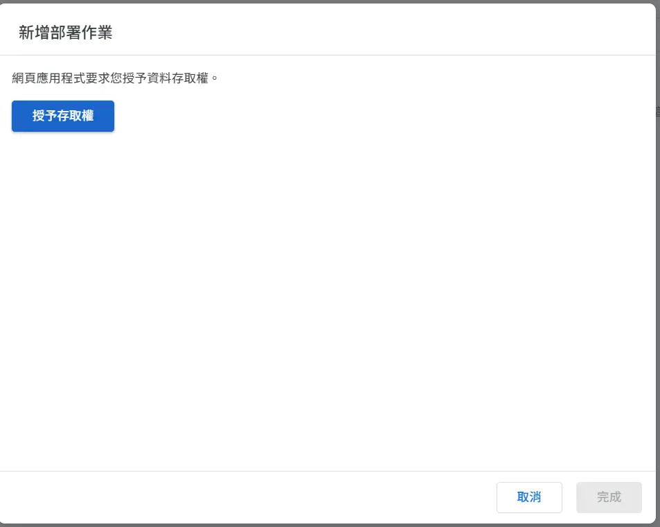
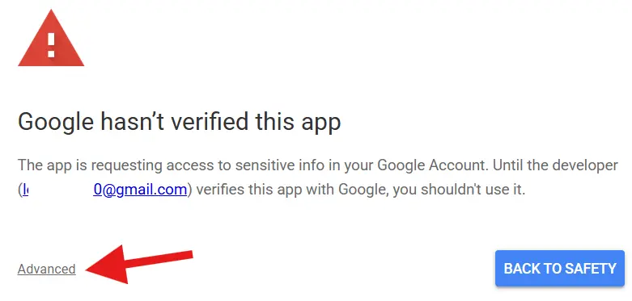
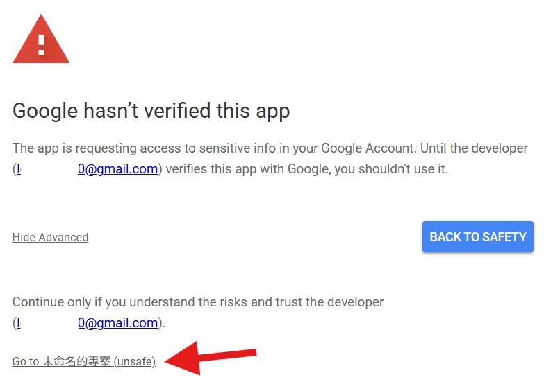
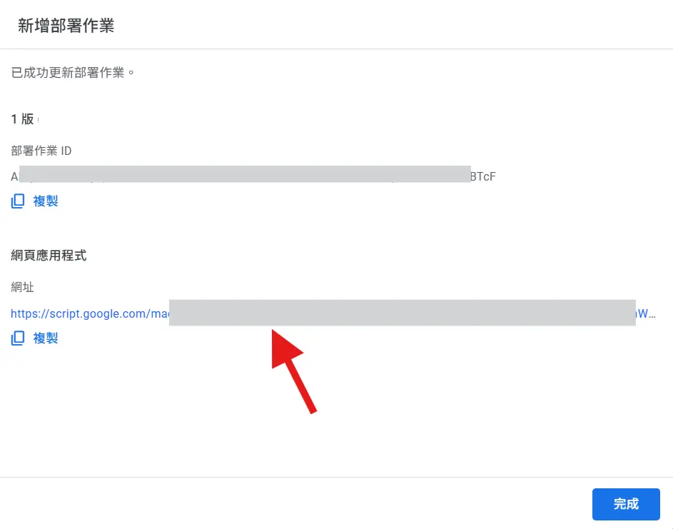

記帳是現在許多理財方法中的其中一個重要項目，記帳不僅可以讓我們看見自己平常都把錢花到哪裡去，也可以幫助我們規劃後續的財務分配。

我在大學時期用過蠻多款記帳APP，有單純記帳的、也有把記帳做成小遊戲，每次記帳可以擴展自己的城市的，但最後都用不久。

在一番摸索和研究之後，我找到了現在對我來說最適合我，也是我覺得應該會適合大多數人的方式，因此我決定在這邊分享我的方式。

我將本文做成上下兩章，
[上篇](content/blog/2025-12-08.md)會跟大家分享在養成記帳習慣時的阻礙，以及我們如何降低或克服這些阻礙，也協助閱讀的大家來思考並制訂適合自己的方式。

本篇則是會帶大家一起，在沒有任何程式基礎的情況下，搭建一套屬於自己的記帳系統，而且完全免費。

如果你還沒有閱讀過上一篇，強烈建議先閱讀上篇後再繼續閱讀本篇：
[Less is more: 養成記帳好習慣（上）-養成習慣的重要心法](content/blog/2025-12-08.md)

最後，本教學會以iPhone為例，但安卓手機一定也能做到同樣的事情，但因為我沒有實際測試過所以這部份就交給有興趣的朋友們自行實驗了。

---
# 前言
先展示結果：

整個記帳流程只需要不到15秒，沒有其他繁瑣的開啟應用程式、看廣告、選圖標等功能，就只是單純的記賬。

而記錄下來的資料則會被儲存在你自己的Google Sheets中：


用這種方式來記帳的好處：
1. 流程簡單，所以心理負擔低，更容易養成記帳習慣。
2. 資料完全由你掌控，多數的記帳APP如果要匯出資料都是要付費的，或是根本沒有資料匯出功能。
3. 記帳的流程、項目、帳目的分類等資料，全部都可以由你自訂。
4. 結構明確的試算表檔案，如果你想，你甚至可以把檔案匯入到統計軟體當中進行分析，或是直接在Google Sheets當中進行簡單的描述性統計；更可以把試算表檔案丟給AI，讓AI幫你分析你的財務情況，總之可玩性超多。
5. 可以定期從google下載檔案來進行備份，多一分保障。

---
# 教學開始
## 前置要求
1. 一個Google帳號
2. 一台可以登入Google帳號的電腦
3. 一個ChatGPT或是Gemini免費帳號（如果使用方法１）
4. 一部手機

## 實作方式１：請AI教你
這個實作方式適合想要比較多自訂欄位與功能的朋友，需要對AI和電腦稍微比較熟悉一些，才比較不會看不懂流程。

這個方法其實是我最推薦的，因為過程中有不會的都可以問AI，非常方便而且立即快速。唯一要注意的部分是請使用足夠聰明的大模型，最安全保險就是ChatGPT或是Gemini中的新模型。

### 步驟１：打開AI輸入提示詞
打開你擁有的AI工具，輸入以下提示詞（可以直接複製，或是將資料結構、輸入流程等資訊改為你需要的）：

>請扮演一位自動化工作流開發專家，協助我構建一個整合 iPhone「捷徑 (Shortcuts)」、Google Sheets 和 Google Apps Script (GAS) 的專屬記帳工具。請提供完整的程式碼、部署設定與捷徑製作步驟，具體要求如下：
> 
> **1. 後端設定 (Google Sheets & Apps Script)：**
> * **資料結構：** 試算表需包含四欄：A欄「支出時間」（由腳本自動生成 timestamp）、B欄「支出項目」、C欄「支出金額」、D欄「支出類別」。
> * **腳本編寫：** 請提供一段 Google Apps Script 的 `doPost(e)` 函數程式碼。該函數需能接收 JSON 格式的 Post 請求，解析數據，並將資料依序寫入試算表的下一空白列。
> * **部署指導：** 請詳細說明如何將腳本部署為「網頁應用程式 (Web App)」，並明確指出權限設定（如：執行身分為「我」，存取權限為「任何人」），以確保 iPhone 捷徑能成功呼叫 API。
> 
> **2. 前端設定 (iPhone 捷徑)：**
> * **輸入流程：** 請設計一個順暢的捷徑腳本，依序彈出以下輸入視窗：
>     1.  **支出金額**（限制輸入為數字）。
>     2.  **支出類別**（從預設的選單列表中選擇，例如：餐飲、交通、娛樂）。
>     3.  **支出項目**（文字輸入）。
> * **數據傳輸：** 教導我如何將上述三個變數組合成「字典」或 JSON 格式，並使用「取得 URL 的內容 (Get Contents of URL)」動作，透過 POST 方法發送到剛才部署的 GAS URL。
> * **主畫面設置：** 說明如何將此捷徑加入 iPhone 主畫面作為圖示。
> 
> 請確保解決方案包含錯誤處理建議（例如：若網路不通時的提示），並以步驟分明的教學形式輸出。
### 步驟２：按照AI的指示來操作
到這裡基本上已經結束方法１的所有步驟，剩下的就是按照AI的指示來操作，如果過程中有不懂的地方，也可以直接問AI，祝你成功！

---
## 實作方式２：抄我的作業（不需要AI）
### 步驟１：建立google Sheet檔案
首先，我們需要一個雲端試算表來接收與儲存資料。
1. 登入你的Google帳號
2. 點進Google試算表（Google Sheets）
3. 新增一個試算表檔案
4. 命名試算表（例如我的是「**消費明細(輸入)**」）
5. 在第一橫列設定項目與標題
	1. 支出時間
	2. 支出項目
	3. 支出金額
	4. 支出類別

做完之後你會有一個像這樣的試算表：

### 步驟２：設定Google Apps Script
1. 在Google Sheet上面的工具列找到「擴充功能」→「Apps Script」
	
2. 點進去之後會看到這樣的頁面
	
3. 把右側的程式碼都刪掉，改成貼上這段程式碼：

```
function doPost(e) {
var sheet = SpreadsheetApp.getActiveSpreadsheet().getSheetByName('消費明細(輸入)'); // 如果你的工作表不是這個名稱，請改成你的表單名稱
var params = JSON.parse(e.postData.contents);
  // 依照你的表單順序寫入
var newRow = [
new Date(), // 自動填寫時間
params.object || '',
params.price || '',
params.type || '',
  ];
  sheet.appendRow(newRow);
  return ContentService.createTextOutput(
    JSON.stringify({ result: 'success', row: newRow })
  ).setMimeType(ContentService.MimeType.JSON);
}
```

4. 貼上後，點選磁碟片標示的儲存按鈕
	
5. 點選視窗右上角的「部屬」按鈕，並選擇「新增部屬作業」
	
6. 點選「選取類型」旁邊的齒輪圖示，選取「網頁應用程式」
	
7. 填入相關資訊：執行身分選擇「我」，誰可以存取選擇「所有人」
	
8. 點按右下角的「部屬」按鈕
9. 點選「授予存取權」
10. 進入帳號選擇頁面，選擇你建立Apps Script的帳號
11. 之後會跳出警訊畫面，點選「Advanced」，然後選擇最下方的「Go to 未命名的專案(unsafe)」
	
	
12. 完成授權作業，此時你應該會收到一封來自Google系統的E-mail
13. 複製「網頁應用程式」下方的「網址」
	
### 步驟３：設定iOS捷徑
1. 用手機開啟[此連結](https://www.icloud.com/shortcuts/a1958c09808d428284eff16689aa51a7)來匯入「記帳範本」捷徑
2. 匯入後，點按範本卡片右上角的三個橫點進入編輯頁面
3. 將下方「這裡輸入步驟2最後一步所複製的網址」，替換為你剛才複製的網址
	
4. 點選下方分享按鈕，選擇「加入主畫面」

至此，恭喜你已經成功製作了一個屬於你的個人記帳系統！快去測試吧～
這個記帳工作流真的還有非常多可以讓你自由客製化的空間，你可以依照你的個人需求再多玩玩看，如果有遇到錯誤的地方可以詢問你的AI，或是來信詢問我，如果有許多人都遇到同樣問題，我會再出一篇文來解答～