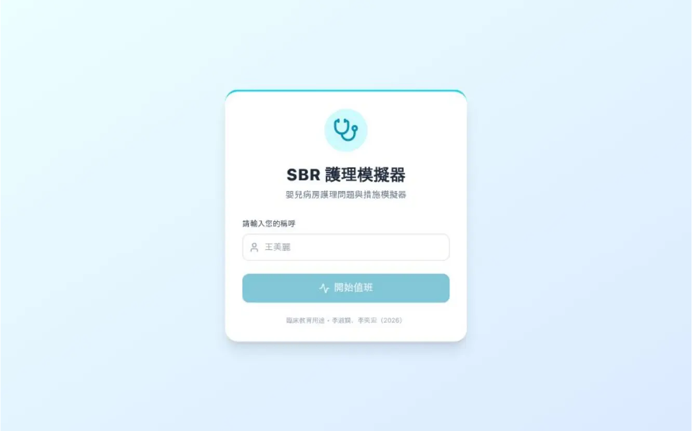

# SBR護理模擬器

## [點此開始遊玩](https://sbr.yi-hung-lee.work/)

【SBR護理模擬器】是一款專為護理實習生設計的互動式臨床模擬網頁遊戲，透過模擬嬰兒病房真實案例，訓練護生進行護理診斷判讀與臨床處置決策。

## 專案介紹

這是一個基於 React 與 TypeScript 開發的嬰兒病房（SBR/NICU）臨床模擬教學應用。專案旨在幫助護理學生彌補理論與臨床實務間的差距。

玩家將扮演值班護理師，面對隨機順序的病人案例（如呼吸窘迫症候群、胎便吸入、敗血症等），系統會呈現病患的生命徵象與臨床表徵。

遊戲流程包含兩大核心挑戰：

1. **護理診斷**：玩家需根據病徵輸入 NANDA-I 標準護理問題，系統透過關鍵字比對演算法進行自動評分與即時回饋。
    
2. **護理措施**：玩家需從眾多處置中選出正確且優先的護理措施，考驗對治療計畫的熟悉度。

# 功能亮點

* **隨機病歷順序**每次練習都會遇到不盡相同的案例出現，保持每次練習都有不同體驗。
  
* **智慧評分系統**：包含模糊比對與關鍵字偵測，能針對使用者的文字輸入給予精準的評分與導師建議。
  
* **即時回饋機制**：作答後立即顯示正確答案、臨床解析與錯誤分析，強化學習效果。
